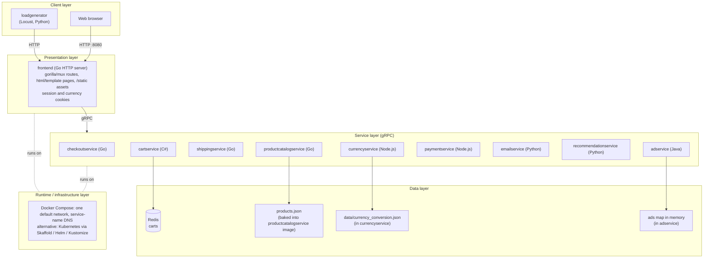
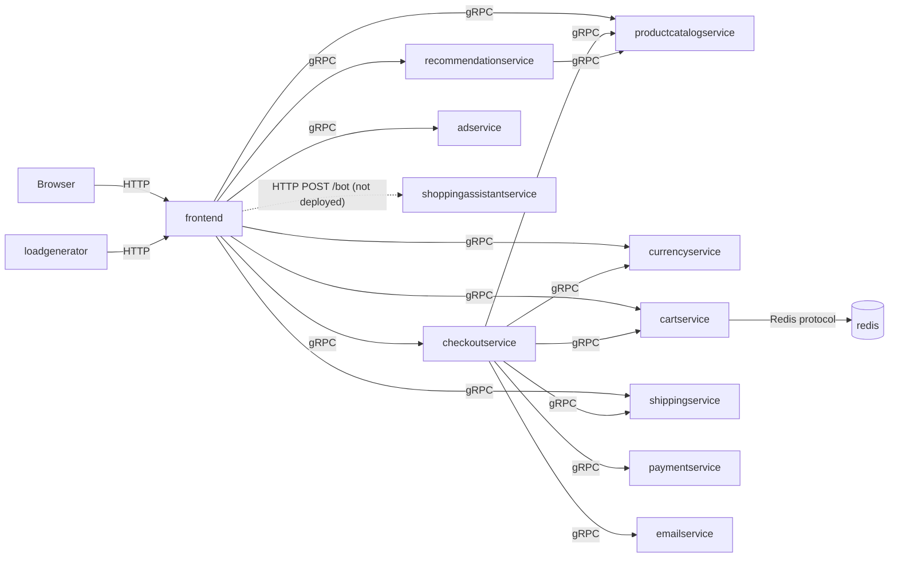
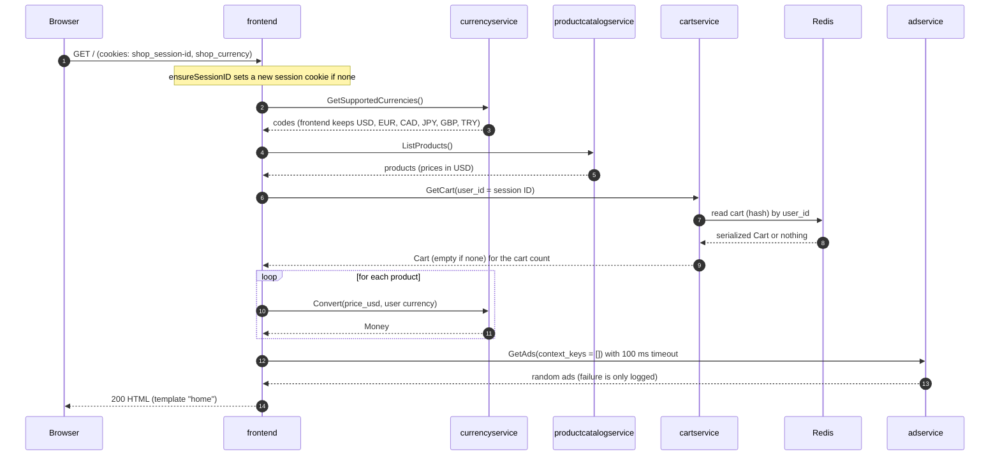
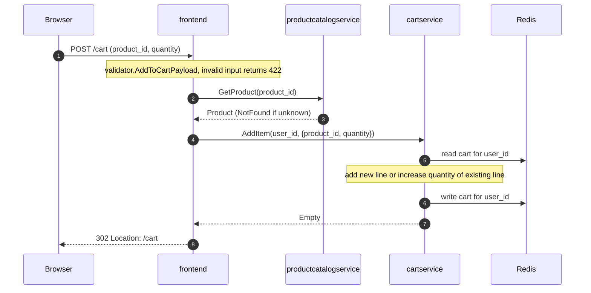
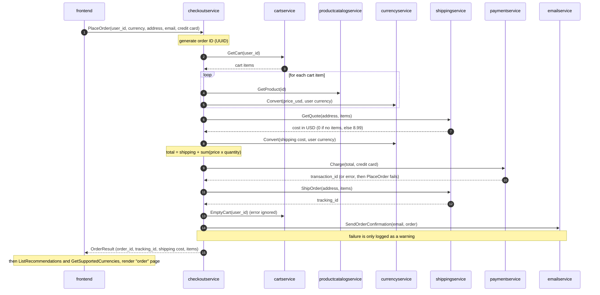

# Architecture

This page explains how Online Boutique works: its layers, its services, and how a request moves
through them. Everything here matches the code on this branch. Where the page names a file, that
file is the source of truth.

## 1. Overview

Online Boutique is a demo web shop. Shoppers browse products, pick a currency, add items to a
cart and place an order. The app is split into small services written in Go, C#, Java, Node.js
and Python. They talk to each other over **gRPC**, using one shared contract,
[`protos/demo.proto`](../protos/demo.proto). Only the `frontend` speaks HTTP to the browser.

What this fork changes compared with upstream:

- **Runs locally with Docker Compose and no Google services.** The root
  [`docker-compose.yml`](../docker-compose.yml) builds every service from `src/` and adds a
  Redis container for carts. Spanner, AlloyDB, Memorystore, Cloud Profiler and the GCP metadata
  server are no longer used by the code.
- **The shopping assistant is not wired.** `src/shoppingassistantservice` (Gemini + AlloyDB) is
  not part of the Compose stack. The frontend still needs `SHOPPING_ASSISTANT_SERVICE_ADDR` at
  startup, so Compose sets a placeholder value.

The Kubernetes path (`skaffold run`, `kubernetes-manifests/`, `kustomize/`, `helm-chart/`) still
exists as an alternative way to deploy.

## 2. Layered view

**Observability note.** OpenTelemetry tracing code is present in most services but is **off by
default**. The Go, Node.js and Python services only export traces when `ENABLE_TRACING=1`, and
then send them to `COLLECTOR_SERVICE_ADDR`. Compose sets neither, so no collector is needed.
See [section 7](#7-cross-cutting-concerns).

## 3. Service catalog

Ports are the ones set in `docker-compose.yml`. All services except `frontend` and
`loadgenerator` are gRPC servers.

| Service | Language | Port (Compose) | gRPC service (`demo.proto`) | Responsibilities | Calls | Data it owns |
| :-- | :-- | :-- | :-- | :-- | :-- | :-- |
| `frontend` | Go | 8080 (published on host) | none (HTTP server) | Renders the shop pages, handles forms, sets cookies | productcatalog, currency, cart, recommendation, shipping, checkout, ad | Cookies only (`shop_session-id`, `shop_currency`) |
| `checkoutservice` | Go | 5050 | `CheckoutService.PlaceOrder` | Runs the order workflow | cart, productcatalog, currency, shipping, payment, email | None (stateless) |
| `productcatalogservice` | Go | 3550 | `ProductCatalogService` (`ListProducts`, `GetProduct`, `SearchProducts`) | Serves the product list | none | `products.json` (9 products) |
| `shippingservice` | Go | 50051 | `ShippingService` (`GetQuote`, `ShipOrder`) | Flat-rate quotes, mock tracking IDs | none | None |
| `cartservice` | C# (.NET 10) | 7070 | `CartService` (`AddItem`, `GetCart`, `EmptyCart`) | Stores each user's cart | Redis | Carts in Redis |
| `currencyservice` | Node.js | 7000 | `CurrencyService` (`GetSupportedCurrencies`, `Convert`) | Converts money between currencies | none | `data/currency_conversion.json` (33 rates) |
| `paymentservice` | Node.js | 50051 | `PaymentService.Charge` | Validates the card, returns a fake transaction ID | none | None |
| `emailservice` | Python | 8080 | `EmailService.SendOrderConfirmation` | Logs that a confirmation would be sent (dummy mode) | none | Jinja template `templates/confirmation.html` |
| `recommendationservice` | Python | 8080 | `RecommendationService.ListRecommendations` | Picks up to 5 random other products | productcatalog | None |
| `adservice` | Java | 9555 | `AdService.GetAds` | Returns text ads by category, or random ones | none | Ads map in memory |
| `loadgenerator` | Python (Locust) | none | none | Simulates shoppers | frontend (HTTP) | None |
| `redis` | Redis 8 (alpine) | 6379 (internal) | none | Cart store | none | Cart data |

`shoppingassistantservice` exists in `src/` but is not in Compose.

## 4. Service dependency graph

## 5. Key request flows

### (a) Browse the home page — `GET /`

`homeHandler` in [`src/frontend/handlers.go`](../src/frontend/handlers.go) makes these calls in
order. The home page does **not** call the recommendation service; recommendations appear on the
product, cart and order pages.

The product page (`GET /product/{id}`) is similar: `GetProduct`, `GetSupportedCurrencies`,
`GetCart`, one `Convert`, then `ListRecommendations` with the product ID (errors only logged)
and `GetAds` with the product's categories.

### (b) Add to cart — `POST /cart`

### (c) Checkout — `POST /cart/checkout`

The frontend validates the form, then calls `PlaceOrder`. The order of steps below matches
`PlaceOrder` in [`src/checkoutservice/main.go`](../src/checkoutservice/main.go).

## 6. The layers in detail

### 6.1 Presentation layer — `src/frontend`

The frontend is a Go HTTP server ([`main.go`](../src/frontend/main.go)) using gorilla/mux. It
opens one gRPC client connection per backend at startup (plaintext, no TLS).

| Route | Method | Handler | What it does |
| :-- | :-- | :-- | :-- |
| `/` | GET, HEAD | `homeHandler` | Product grid, currency picker, cart count, one ad |
| `/product/{id}` | GET, HEAD | `productHandler` | Product details, recommendations, ad |
| `/cart` | GET, HEAD | `viewCartHandler` | Cart lines, shipping quote, total, recommendations |
| `/cart` | POST | `addToCartHandler` | Adds an item, redirects to `/cart` |
| `/cart/empty` | POST | `emptyCartHandler` | Empties the cart, redirects to `/` |
| `/cart/checkout` | POST | `placeOrderHandler` | Calls `PlaceOrder`, renders the order page |
| `/setCurrency` | POST | `setCurrencyHandler` | Sets the currency cookie, redirects to the referer |
| `/logout` | GET | `logoutHandler` | Expires all cookies, redirects to `/` |
| `/assistant` | GET | `assistantHandler` | Assistant page (the backend is not deployed here) |
| `/bot` | POST | `chatBotHandler` | Forwards the body over HTTP to `SHOPPING_ASSISTANT_SERVICE_ADDR` |
| `/product-meta/{ids}` | GET | `getProductByID` | Product as JSON |
| `/static/*` | GET | file server | CSS, images, icons from `./static/` |
| `/robots.txt`, `/_healthz` | GET | inline | `Disallow: /` and `ok` |

- **Middleware chain** (outermost first): `otelhttp` handler, `ensureSessionID`, `logHandler`
  (JSON logs with a request ID), then the router.
- **Session cookie** `shop_session-id`: a random UUID set on the first visit, valid 48 hours. It
  is the `user_id` sent to cart, recommendation and checkout. With
  `ENABLE_SINGLE_SHARED_SESSION=true` every visitor shares one fixed ID.
- **Currency cookie** `shop_currency`: set by `/setCurrency`, default `USD`. Only USD, EUR, CAD,
  JPY, GBP and TRY are shown, even though currencyservice supports more.
- **Templates** live in `src/frontend/templates/` (`home`, `product`, `cart`, `order`, `error`,
  `assistant`, plus header, footer, ad and recommendations partials). Every page also gets common
  data such as session ID, currency, platform banner and `baseUrl`.
- **Errors**: a failed required call renders the `error` template with HTTP 500. Invalid form
  input returns 422. Ads and recommendations are optional: their errors are only logged.

### 6.2 API contract — `protos/demo.proto`

- One proto file (package `hipstershop`) defines all messages and the nine gRPC services listed
  in [section 3](#3-service-catalog). Each service has its own generated code (`genproto/`,
  `demo_pb2*.py`, `proto/` folders, or build-time generation for C# and Java).
- Money is a `Money` message (`currency_code`, `units`, `nanos`). Product prices are stored in
  USD and converted per request.
- Every gRPC server also registers the standard `grpc.health.v1.Health` service. The frontend
  exposes HTTP `/_healthz` instead.

### 6.3 Service internals

- **checkoutservice** — stateless orchestrator; see flow (c). A payment failure returns
  `Internal`, a shipping failure returns `Unavailable`.
- **productcatalogservice** — `loadCatalog` reads `products.json` from the working directory with
  `jsonpb`. `SearchProducts` does a case-insensitive match on name and description.
  `EXTRA_LATENCY` (a Go duration) adds a delay to every call. `SIGUSR1` turns on reloading the
  file on every request, `SIGUSR2` turns it off.
- **shippingservice** — `GetQuote` returns USD 0 for zero items and USD 8.99 otherwise.
  `ShipOrder` builds a tracking ID from the address. Nothing is shipped.
- **cartservice** — ASP.NET Core gRPC on HTTP/2 port 7070 (`ASPNETCORE_HTTP_PORTS` in its
  Dockerfile). See [6.4](#64-data-layer).
- **currencyservice** — loads `data/currency_conversion.json` (rates relative to EUR). `Convert`
  goes from the source currency to EUR and then to the target currency.
- **paymentservice** — `charge.js` checks the card with `simple-card-validator`. It rejects
  invalid numbers, card types other than VISA and Mastercard, and expired cards. Otherwise it
  returns a random UUID as the transaction ID. No money moves.
- **emailservice** — always starts in dummy mode: `DummyEmailService` logs the request and
  returns. The real email class raises "not implemented".
- **recommendationservice** — calls `ListProducts`, removes the products in the request, and
  returns up to 5 random IDs. The frontend shows at most 4.
- **adservice** — a fixed in-memory map from category (`clothing`, `accessories`, `footwear`,
  `hair`, `decor`, `kitchen`) to ads. With no matching category it returns 2 random ads.

### 6.4 Data layer

| Data | Where it lives | Lifetime |
| :-- | :-- | :-- |
| Carts | Redis, through cartservice | Survives cartservice restarts; lost on `docker compose down` |
| Products | `src/productcatalogservice/products.json`, copied into the image | Read-only; change the file and rebuild |
| Currency rates | `src/currencyservice/data/currency_conversion.json` | Read-only, static rates |
| Ads | Java map in `AdService.java` | Read-only, in process |
| Session and currency | Browser cookies | 48 hours |

**Redis keying.** [`RedisCartStore`](../src/cartservice/src/cartstore/RedisCartStore.cs) uses
ASP.NET Core `IDistributedCache` (the StackExchange.Redis implementation). The cache key is the
`user_id` (the frontend session ID) with no prefix. The value is a Redis hash whose `data` field holds the `Cart` protobuf
message serialized to bytes (how StackExchange.Redis `IDistributedCache` stores entries). `AddItem` reads, merges and writes the whole cart. `EmptyCart` writes an
empty cart. `GetCart` returns an empty cart for an unknown user. Any storage error becomes an
`RpcException` with status `FailedPrecondition` ("Can't access cart storage").

**In-memory fallback.** [`Startup.cs`](../src/cartservice/src/Startup.cs) picks the store from
`REDIS_ADDR`. If it is set, carts go to Redis. If it is empty, cartservice uses
`AddDistributedMemoryCache()` with the same `RedisCartStore` class, so carts live only in the
process and are lost on restart. Compose always sets `REDIS_ADDR=redis:6379`.

### 6.5 Runtime layer

**Docker Compose (default in this fork).**

- Each app service is built from its own directory (`build.context: ./src/<service>`; for
  cartservice it is `./src/cartservice/src`). Redis uses a pinned `redis:8.10.2-alpine` image.
- All containers share the default Compose network and find each other by service name, for
  example `cartservice:7070`.
- Only `frontend` publishes a port (`8080:8080`).
- Health checks: `frontend` runs `wget` on `/_healthz`; `redis` runs `redis-cli ping`.
- Start order (`depends_on`): cartservice waits for Redis to be healthy; loadgenerator waits for
  frontend to be healthy; frontend, checkoutservice and recommendationservice wait for their
  backends to be started (not healthy).

**Kubernetes (alternative).** `skaffold run` builds the images and applies
[`kubernetes-manifests/`](../kubernetes-manifests) (one Deployment and Service per app, plus a
`redis-cart` Deployment for carts). [`kustomize/`](../kustomize) adds optional components, and
[`helm-chart/`](../helm-chart) is a Helm package of the same app. Some kustomize components still
target Google Cloud (for example `alloydb`, `spanner`, `memorystore`) and were not changed for
this fork.

### 6.6 Configuration

Only variables that the code reads are listed.

| Variable | Read by | Meaning | Default |
| :-- | :-- | :-- | :-- |
| `PORT` | frontend, checkout, productcatalog, shipping, currency, payment, email, recommendation, ad | Listen port | Service-specific (see section 3); currency and payment have no default |
| `LISTEN_ADDR` | frontend | Listen host | empty (all interfaces) |
| `PRODUCT_CATALOG_SERVICE_ADDR` | frontend, checkout, recommendation | Catalog address | required |
| `CURRENCY_SERVICE_ADDR` | frontend, checkout | Currency address | required |
| `CART_SERVICE_ADDR` | frontend, checkout | Cart address | required |
| `RECOMMENDATION_SERVICE_ADDR` | frontend | Recommendation address | required |
| `SHIPPING_SERVICE_ADDR` | frontend, checkout | Shipping address | required |
| `CHECKOUT_SERVICE_ADDR` | frontend | Checkout address | required |
| `AD_SERVICE_ADDR` | frontend | Ad address | required |
| `SHOPPING_ASSISTANT_SERVICE_ADDR` | frontend | Assistant HTTP address | required (placeholder in Compose) |
| `PAYMENT_SERVICE_ADDR`, `EMAIL_SERVICE_ADDR` | checkout | Payment and email addresses | required |
| `REDIS_ADDR` | cartservice | Redis `host:port`; empty means in-memory store | empty |
| `ENABLE_TRACING` | frontend, checkout, productcatalog, currency, payment, email, recommendation | `1` turns on OTel trace export | off |
| `COLLECTOR_SERVICE_ADDR` | same as above | OTLP gRPC collector address | required when tracing is on (Python: `localhost:4317`) |
| `OTEL_SERVICE_NAME` | currency, payment | Service name in traces | service name |
| `DISABLE_TRACING`, `DISABLE_STATS` | shipping, ad | Log switches; tracing and stats are not implemented there | unset |
| `EXTRA_LATENCY` | productcatalog | Delay added to each call | none |
| `ENV_PLATFORM` | frontend | Platform banner: `local`, `gcp`, `aws`, `azure`, `onprem`, `alibaba` | `local` |
| `BASE_URL` | frontend | Path prefix for all routes | empty |
| `BANNER_COLOR`, `FRONTEND_MESSAGE`, `CYMBAL_BRANDING` | frontend | Cosmetic page options | unset |
| `ENABLE_ASSISTANT` | frontend | Shows the assistant UI when `true` | off |
| `ENABLE_SINGLE_SHARED_SESSION` | frontend | All visitors share one session ID when `true` | off |
| `PACKAGING_SERVICE_URL` | frontend | Optional packaging info on product pages | unset |
| `FRONTEND_ADDR`, `USERS`, `RATE` | loadgenerator | Target host, user count, spawn rate | Compose: `frontend:8080`, `10`, `1` |

"Required" means the service panics or raises at startup when the variable is missing
(`mustMapEnv` in Go, an explicit check in recommendationservice).

## 7. Cross-cutting concerns

**Observability.**
- Logs: the Go services log JSON with logrus; Node uses pino; Python uses a JSON logger. In
  Compose, read them with `docker compose logs <service>`.
- Traces: off unless `ENABLE_TRACING=1` and a collector is reachable at
  `COLLECTOR_SERVICE_ADDR`. The frontend always wraps handlers and gRPC clients with OTel
  instrumentation, but without a configured exporter nothing is sent.
- shippingservice and adservice have no working tracing or stats; they only log the switch.

**Security.** This is a demo, not a real shop.
- There is no login and no authorization. A user is whoever holds the session cookie.
- All gRPC traffic is plaintext inside the network. Only the frontend is published in Compose.
- Payment is fake: the card is validated (valid number, VISA or Mastercard, not expired) and never
  charged. Emails are never sent.

**Failure modes.**

| Failure | Effect |
| :-- | :-- |
| Redis down | cartservice returns `FailedPrecondition`; the frontend renders a 500 page ("could not retrieve cart") on `/`, `/product/{id}` and `/cart`. This is scenario T-026 in [`docs/work/001-no-google-docker-compose/2-tests.md`](work/001-no-google-docker-compose/2-tests.md), checked by the user-local smoke runbook. |
| A required backend (catalog, currency, cart, shipping, checkout) down | The page that needs it returns 500. |
| adservice or recommendationservice down | Page still renders, without ads or recommendations (warning logged). |
| Payment rejects the card | `PlaceOrder` fails; the frontend shows a 500 page with the error. Nothing is shipped and the cart is kept. |
| emailservice down | The order still succeeds; checkout logs a warning. |
| `/bot` in Compose | Fails with 500, because no shopping assistant is deployed. |
| A required address variable missing | The service exits at startup. |

## 8. Where to go next

- [README: Run locally with Docker Compose](../README.md#run-locally-with-docker-compose-no-google-services)
  — how to start the stack.
- [Shopping assistant with Ollama](shopping-assistant-ollama.md) — running the assistant with a
  local model (a plan, not yet implemented).
- [Adding a new microservice](adding-new-microservice.md).
- [Development guide](development-guide.md).
- [Live-smoke runbook](test/001-no-google-docker-compose/runbook.md) — end-to-end checks of a
  local run.
